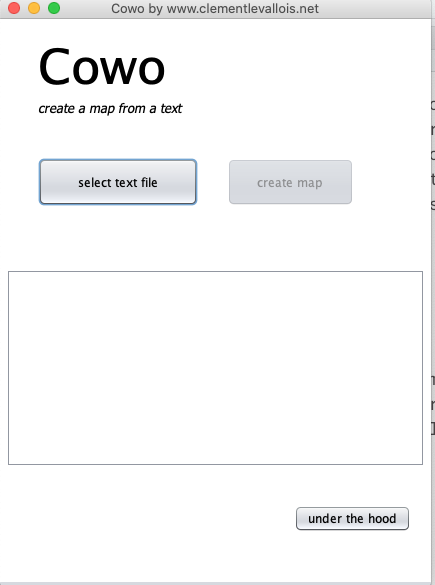
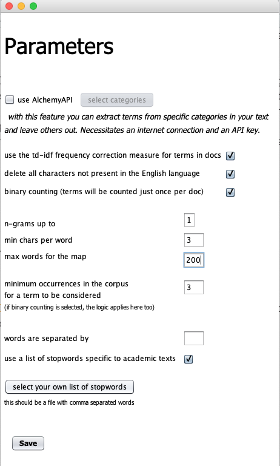
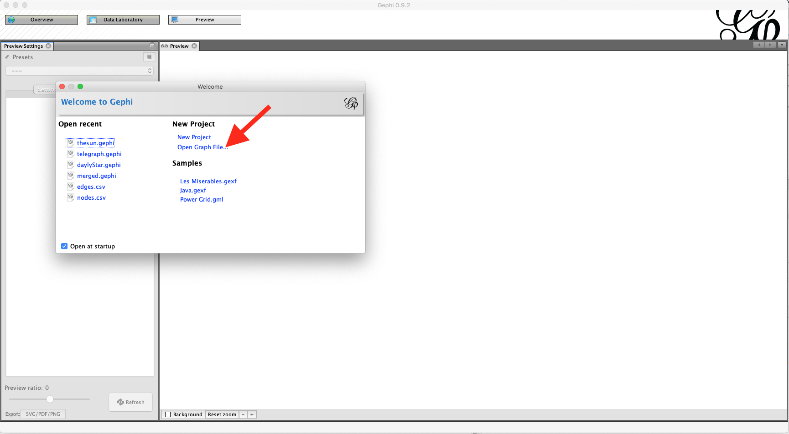
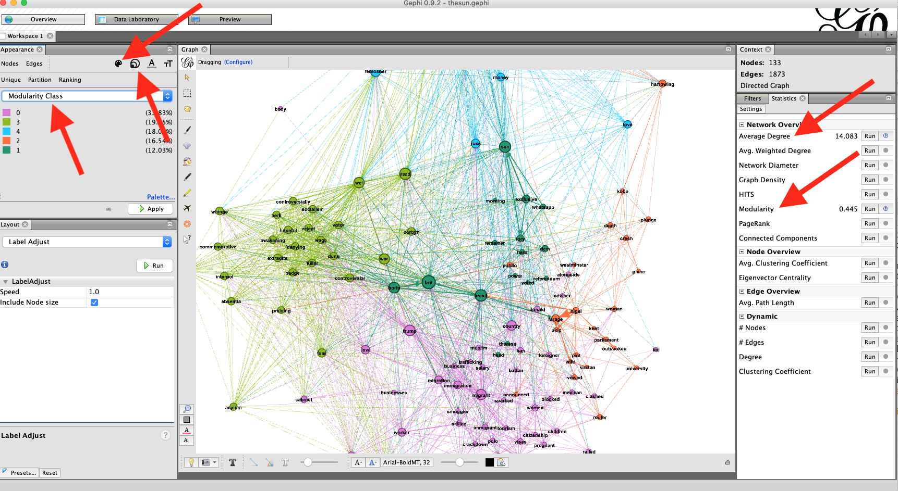
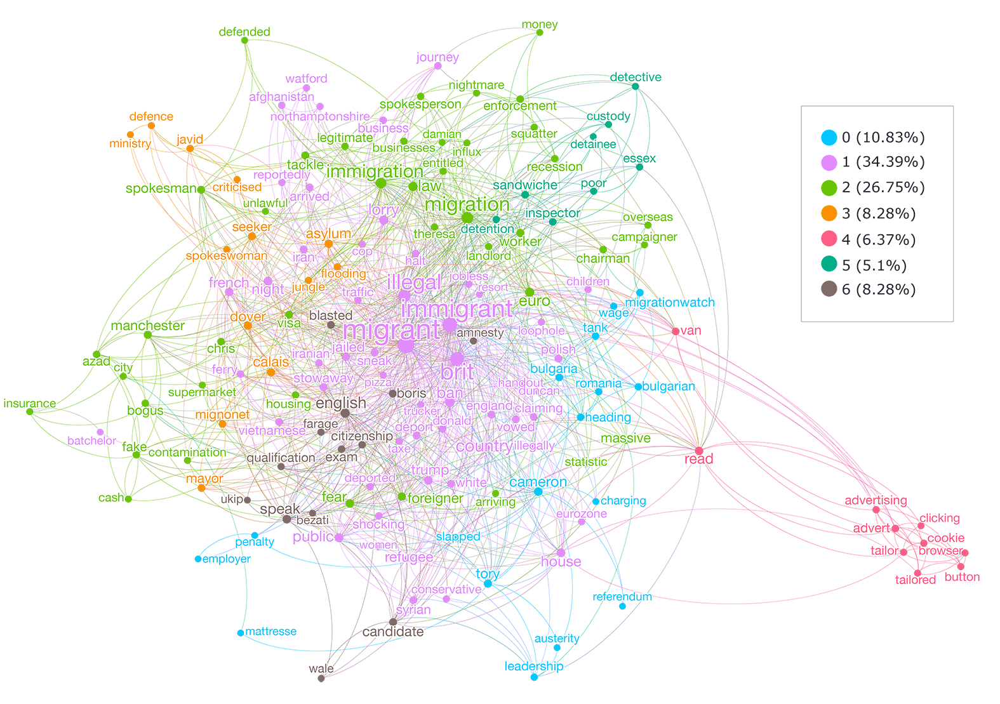
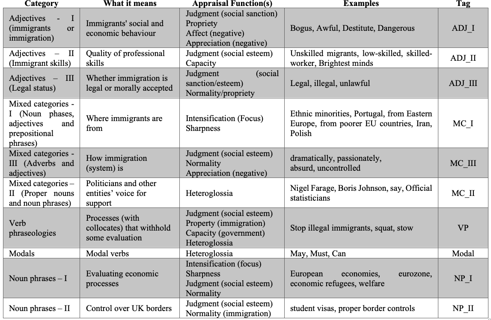
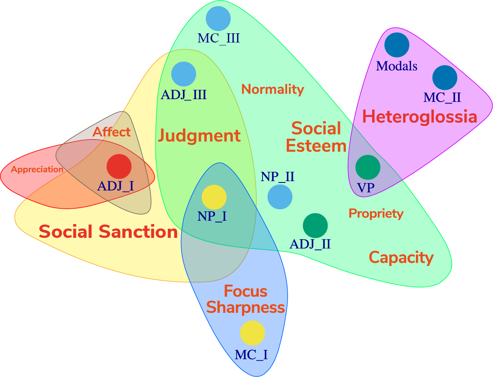
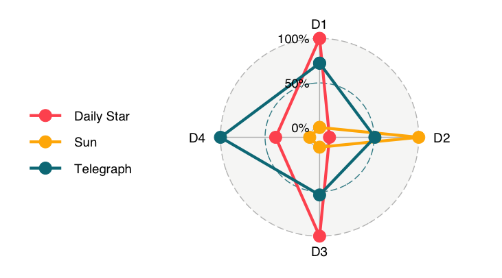

# Introduction

[Rodrigo Esteves de Lima-Lopes](mailto:rll307@unicamp.br) (State University of Campinas)

This scripts bring the methodological steps for my paper:

Lima-Lopes, Rodrigo Esteves de. 2020. ‘Immigration and the Context of  Brexit: Collocate network and Multidimensional Frameworks Applied to Appraisal in SFL’. *Muitas Vozes* **9** (1): 410–41. [https://doi.org/10.5212/MuitasVozes.v.9i1.0024](https://doi.org/10.5212/MuitasVozes.v.9i1.0024)

The article is in a open science journal, just follow the [link](https://doi.org/10.5212/MuitasVozes.v.9i1.0024)

Please, drop me a line if any doubt pops up.

# Thank you note

I would like to express my gratitude to Cardiff University (Wales-UK) and CNPq (Brazilian National Council for Scientific and Technological Development) for financing this research and to Dr Lise Fontaine for supporting this project.

# Methods

## Objectives

The analysis is twofold. First, a network of collocates was processed. Such collocates aided in recognising the main aboutness, appraisal and linguistic features of each set of newspaper articles. This network of collocations worked as an initial survey of the categories and lexicogrammatical choices that would represent them within the corpus. This approach made it possible for the categories of analysis to emerge from the corpus, instead of being defined beforehand. Although the theory of appraisal proposes a series of possible lexicogrammatical elements for analysis, it is believed that the texts, within their specific register, would reveal their own specific characteristics. To some extent, fear of immigration and EU policies might translate such frameworks into some linguistic choices.

The understanding of such choices would contribute to the analysis of roles they might play in this representational scenario. As the aim of this paper is to analyse how immigrants and the UK immigration system are represented in three conservative UK newspapers, the survey will take into account lexicogrammatical categories which might translate into appraisal meanings. This is because, in some cases, the expression of the evaluation process was instanced by choices at both levels of analysis. The tools for this analysis were [Cowo](https://github.com/seinecle/Cowo), a tool responsible for creating the networks of collocates, [Gephi](https://gephi.org/), which plots networks, and a set of scripts written in the R language for statistical analysis, concordancing and statistical plotting.

After this initial analysis, the texts underwent semi-automatic tagging using the categories elicited in the cluster analysis. The tagged text was the basis for the factorial analysis of the appraisal system in the 98 texts collected. The lexicogrammatical choices congregated into dimensions which would represent their positive (and negative) co-occurrence within the texts. The factor analysis was also the basis for profiling each newspaper in terms of the appraisal meanings they actualise.

# Data scraping

Data was scraped using a couple of R packages, all responsible for downloading the data and cleaning the articles:

1.  purrr
2.  xml2
3.  rvest

A fourth package was reponsible for reading the csv files for data processing:

-   readr

These procedures will be covered by a singe `R` file (`Data_Scr.R`). The file contains the functions for downloading the articles form web and pre-processing and cleaning text data.

# Network analysis of Lexis

The image Click on *select file* and choose the texts. In this study I have chosen to use a file for each newspaper, so I could analyse them separately.

You should use the same parameters I used in the article

-   Unselect td-idf option.

    -   This calculation tends to make more common words less relevant in the results.

        -   We will not need it because we will use a list of stopwords and perform a series of calculations in Gephi later.

-   Delete all characters not present in English.

-   I considered only words larger and equal to 3 characters

-   I chose to have no more than 200 words per map

    -   It makes reading a lot easier

-   The minimum occurrence of a word to be in my graph will be 3

-   I used a stopwords list for English language available at [Ranks NL Webmaster Tools](https://www.ranks.nl/stopwords).

After we processes the files, COWO we will use another software [VosViewer](http://www.vosviewer.com) as a *passage* to Gephi.

Here are the instructions:

-   Go to [VosViewer](http://www.vosviewer.com) and download it

-   Open VosViewer

-   In the action tab, click on create

-   Choose "create a map based on a network"

    -   Select the \*.map file COWO just created
    -   Select the network file COWO just created

-   Click next until the network show up.

[VosViewer](http://www.vosviewer.com) is a nice programme, but the options are not so good as they are in [Gephi](https://gephi.org/). This is the reason why we export the file as a **GraphML** or **GML** format to open it in Gephi.

After you exported the files, start Gephi. Click on open graph file (see image below) and open the network.

After you open the file, perform the following calculations (see image above):

-   Modularity Class
-   Average Degree

Then apply the following size and colour configuration - Size -\> ranking -\> degree and apply size 21 - 50 to the size of the nodes - Colour -\> Partition, modularity class.

Finally, go to the preview tab, mark show labels and preview the network. It might be something similar to it:

Please, note that the Key (legend) was added using Adobe Illustrator. Each colour would represent a cluster, the more centred words are more important in terms of co-occurrence.

# Semi-automatic tagging, multidimensional analysis and concordancing

The next step was to tag the corpus in order to enable factor analysis. Three R packages we used for this task:

1.  `RQDA`: It is a package for qualitative data analysis. It integrates qualitative coding with various R programming features.[Available here](http://rqda.r-forge.r-project.org/ "RQDA")
2.  `Psych`: A set of tools for Psychology and Human Sciences Statistics [Available here](https://personality-project.org/r/psych/ "Psych")
3.  `Quanteda`: It offers a set of tools intended to perform quantitative textual analysis. In this research, I used its KWIC feature to map the appraisal in the corpus. [Available here](https://quanteda.io/ "Quanteda")

Each of this steps has an specific R script available at this repository:

-   **Coding** (`Coding.R`): codes for each category in the project and how to apply it via command line in R.
-   **Multidimensional** (`MultiAn.R`): codes and data treatment for factorial analysis.
-   **Concordancing** (`Conc.R`): codes for condordancing.

The table bellow shows the codes for each appraisal strategies and some examples.

For further information regarding the categories and definitions, please refer to the paper. Here are some images ilustrating the results:

